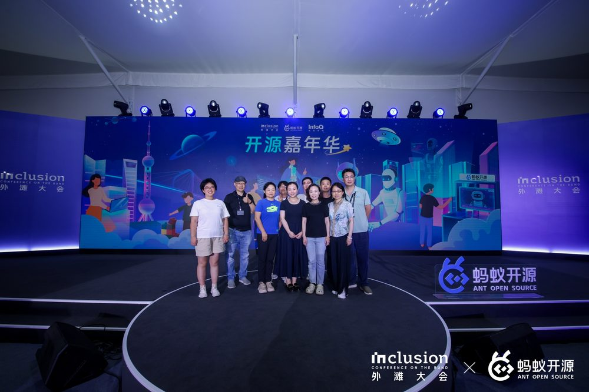

[简体中文](README.md) | [English](README.en.md) | [Русский](README.ru.md) | [Español](README.es.md) | [日本語](README.ja.md) | [한국어](README.ko.md)

# 🔥 [OpenCare コミュニティ](https://info.xiao-x-bao.com.cn) & PancrePal: AIでがん/希少疾患/慢性疾患患者に希望の光を ✨

**天工開物 (<www.xiaoyibao.com.cn>) による公共福祉オープンソースプロジェクト | 最新情報はWeChat公式アカウント：【小胰宝】 (PancrePal) および 【小胰宝助手】 (PancrePal Assistant) をフォローしてください。**

私たちは、コードは単なる冷たい記号ではなく、開発者と患者をつなぐ架け橋であり、テクノロジーによって命を守る温かい力であると深く信じています。

---

## 🎯 コミュニティへの参加 · 2つの道

> **コードは橋、研究は灯台。** 開発者でも研究者でも、あなたの能力を一言でAIエージェントに詰め込み、がん・希少疾患・慢性疾患の患者さんに希望の光を届けましょう ✨
>
> 🚦 **長文を読みたくない？** そのまま **[📋 コミュニティタスクボード · Project →](https://github.com/orgs/PancrePal-xiaoyibao/projects/4)** に飛んでマイルストーンを引き受けるか、**[🌟 2026 ビジョン BillBoard #24 →](https://github.com/PancrePal-xiaoyibao/.github/issues/24)** を開いてこのコミュニティが構築している規模を確認しよう。

<table>
<tr>
<td align="center" width="50%" valign="top">

### 🔨 [CodeForge](https://github.com/PancrePal-xiaoyibao/CodeForge)

**開発者コントリビューション入口**

コミュニティコントリビューションエンジン · Community Contribution Engine

オープンソース初心者のために設計されたAI開発足場。**16の開発 skill + deep-research 深掘り調査エンジン**を、一言でデプロイできるツールセットにパッケージ化しています。

> **issueを見つける → 一言でCodeForgeをデプロイ → 一言でAgentに完成させる → PRを提出**

**こんな方におすすめ:**
- 🌱 初めてのオープンソース貢献をしたい（**ブラウザで15分完結**）
- 💻 すでに開発者で、AIでコミュニティプロジェクトを加速したい
- 🇨🇳 中国製LLMでAgentを動かしたい（GLM-5.2 / DeepSeek / Kimi / MiMo すべて対応）
- 🚀 自分のコード作品をコミュニティに沈殿させ、技術で本当に人を救いたい

**スキルマトリクス:** `/ai-spec` `/deep-research` `/api-first` `/debug` `/code-review` `/gh-actions` `/ralph` … 16+コマンド

</td>
<td align="center" width="50%" valign="top">

### 🧬 [VitaForge](https://github.com/PancrePal-xiaoyibao/VitaForge)

**医学臨床・研究者入口**

医学・生命科学のためのAI4S 干実験エンジン

ワンクリックでデプロイ可能なスキルパック。**28のskill + オーケストレータ**を融合し、医学・生命科学AI4Sの**研究ライフサイクル全体**をカバー — シーケンシングデータから論文発表まで、EBMから助成金申請まで。

> **Forge your AI scientist. From single cell to bedside.**

**こんな方におすすめ:**
- 🩺 あなたが**臨床医・専門看護師**で、EBM根拠、複雑症例分析、臨床研究支援が必要
- 🔬 scRNA-seq / 空間トランスクリプトミクスを扱い、標準化パイプライン（8フェーズ）が必要
- 📚 文献レビュー、論文執筆、SCI投稿、査読応答の反復作業に埋もれている
- 💰 国自然基金（NSFC）本子を書いており、シニア査読者の視点でコーチングが欲しい
- 🎓 医学生・大学院生で、15分以内に初めてのAI4S 干実験フローを走らせたい
- 📝 研究成果をコミュニティに沈殿させ、より多くの患者さんに専門知識を届けたい

**スキルマトリクス:** `/ai4s-lab` `/scrna-bindlab-full-workflow` `/deep-research` `/medical-advisory` `/thesis-writing-mentor` `/sci-journal-submission-expert` `/nsfc-proposal-advisor` … 28 skill

</td>
</tr>
</table>

### 🌟 [コミュニティ 2026 ビジョン BillBoard · 貢献者公開募集 →](https://github.com/PancrePal-xiaoyibao/.github/issues/24)

**どこから始めればいいか分からない？コミュニティが今後 12-24 ヶ月で取り組む 8 つの大きな仕事 — 直接マイルストーンを引き受けよう。**

🧬 ゲノムアトラス · 🔒 データ主権 · 📚 エビデンスグラフ · 🤖 AI インフラ · 🩺 全病程サポート · 💊 生活支援 · 🌐 方法論複製 · 🎓 学術橋渡し

**💎 あなたの作品をコミュニティに沈殿させ · 小さな輝きを大きな希望へ**

✍️ コードプロジェクト → CodeForgeエコシステムへPRで沈殿 &nbsp;·&nbsp; 🧪 研究成果 → VitaForgeでライセンス供与・普及 &nbsp;·&nbsp; 🤝 <a href="mailto:sam.qin@xiaoyibao.com.cn">ライセンス / 提携のご連絡</a>

---

## 🚀 プロジェクト概要

OpenCare（オープンケア）コミュニティとそのサブコミュニティ「PancrePal」（パンクレパル）は、がん患者のためのAI公共福祉プラットフォームです。私たちは、最先端のAI技術を駆使し、「共同意思決定（Shared Decision Management）」の枠組みと独自のコミュニティツール群「ACT (AI-Community-Toolkits)」に基づき、信頼できる「AI + 人間味」のコミュニティを構築することに尽力しています。患者とその家族に身近でプロフェッショナルなケアと情報サポートを提供し、**情報の格差を解消し、生きる希望を照らします。**

## ✨ NEW：コミュニティ主導、小さな輝きから大きな希望へ

**36ヶ月**にわたる改善と進化を経て、PancrePalはオープンソースの礎のもと、**天工開物基金会 (Tiangong Kaiwu Foundation)** から強力な支援を受けています。私たちは、オープンソースの力がより多くの知恵を集め、テクノロジーを真に人々のために役立てることができると確信しています。

**現在、私たちは [RAGコア技術の研究開発と患者ケアシナリオへの応用、患者ライフサイクル管理のためのSkills-hub開発、200以上のオープンソースツール、合併症管理ライブラリ、およびナレッジベースとPRツールエコシステムの構築] に注力しています。コミュニティに寄付してくださった公共福祉開発者の皆様に感謝いたします。**

**また、RAGアプリケーションのマイクロインキュベーション（「小さな輝きから大きな希望へ」協力プラン）は、公共福祉分野におけるRAGおよびAI技術の革新的な応用を推進しています。**

さらに刺激的なことに、私たちは以下の成果を上げています：

* **3年間の実践に基づく成功したACTフレームワークの確立：**
  * *20%のオープンソース技術 + 80%の人道的ケア* の組み合わせこそが、AI技術と公共福祉コミュニティを深く統合し、持続的な発展を可能にします。「青いベスト」ボランティアの貢献に感謝します。これにより、コミュニティは患者と家族のための「ナビゲーションマップ」を提供し、常に更新し続けることができています。私たちの新しいオープンソース哲学は、開発者だけでなく、**「プログラミングはできないが共有することが大好き」**な人道的ケアの貢献パートナーも歓迎します。

    

### コミュニティは約100のサブプロジェクトを公開しており、開発者とオープンソースの力を示しています

* [RAG & 患者管理アプリケーションリポジトリ](https://github.com/PancrePal-xiaoyibao/): RAGアプリケーションとツールに焦点を当てたコミュニティセンター。

* 推奨1：[Xiao Tu Bao](https://github.com/PancrePal-xiaoyibao/ca199_toolbox_donated_by_lihb/)、データプライバシーに配慮した腫瘍マーカー可視化ツール。

* 推奨2：[Pubmed—llm-MCP](https://github.com/PancrePal-xiaoyibao/mcp-pubmed-server-pancrpal): ModelScopeで3,000万回以上使用されたPubmed論文検索ツール。専門的な知識サポートを無料で提供します。
* 推奨3：[PancrePal RAG アプリケーション](https://github.com/PancrePal-xiaoyibao/PancrePal-xiaoyibao)
**詳細については、リポジトリを探索してください。すべての貢献者に感謝します！**

* [OpenCare 患者管理スキルリポジトリ](https://github.com/opencare-skillhub/)

* 推奨1：[llm-wiki](https://github.com/opencare-skillhub/graphify-xiaoyibao): graphifyをベースにしたアプリケーション。患者データ入力 → 関係抽出 → ナレッジグラフ構築。

* 推奨2：[aura](https://github.com/opencare-skillhub/aura_health_profile): **退屈な診療記録管理を、安心できる日々の付き添いに変える。** 慢性疾患患者のためのインテリジェント健康アシスタント。
* 推奨3：[膵臓がんデイリーニュース](https://github.com/opencare-skillhub/pancreatic-cancer-dailynews-skill): コミュニティボランティアによって開発され、治療技術や治験に関するニュースを提供。

**「小さくて美しい」**ツールの特徴を反映したその他のアプリケーション：
    * **「七色のカード」プラン**
    - グリーンカード：遺伝子検査解釈
    - レッドカード：[合併症管理アプリケーション](https://xhk.xiaoyibao.com.cn/)
    - シアンカード：患者QOLコミュニティ

    

    - ホワイトカード：栄養サポート
    - ブルーカード：医患コミュニケーション
    - パープルカード：[心理ケアアプリケーション](https://my-google-ai-studio-applet-425817031228.us-west1.run.app/)
    - オレンジカード：リハビリ管理

### コミュニティはエコシステム活動を積極的に推進し、開発者が社会的価値を獲得し、プロフェッショナルとして成長することを奨励しています。若者が主役となるステージを築いています

**若い力は大歓迎です。** ボランティアからコミュニティ管理者への明確な成長パスを用意しています。

    *   🎉 **OpenCare [AI宝探しプラン](https://wiki.xiao-x-bao.com.cn):** 患者自身によるAIエージェントの構築を奨励。
    *   💗 **合併症への対応 - [レッドカードプロジェクト](https://github.com/PancrePal-xiaoyibao/tiny_red_card.git):** 患者の家族に、合併症管理を最優先するよう呼びかけています！
      
    *   🎉 **GitHub/GitCode でのコード貢献:** オープンソースは私たちのDNAです！3つの主要リポジトリを公開しています：
        *   [PancrePal](https://github.com/PancrePal-xiaoyibao/miniapp-uniapp)
        *   [MinerU-xyb](https://github.com/PancrePal-xiaoyibao/miniapp-uniapp)
        *   [fastgpt-on-wechat](https://github.com/hanfangyuan4396/fastgpt-on-wechat)
        *   [Gemini-2.0 Patient Demo](https://github.com/PancrePal-xiaoyibao/gemini2.0-xiaoyibao)
     
* 👏 **オープンソース医療モデルの探索** [Google_Medgemma3 Test](https://github.com/PancrePal-xiaoyibao/MedGemma3_test_xyb)

* 🎉 **患者共同創造Wiki：** [「膵臓腫瘍合併症・患者共同創造バイブル」](https://bfz.xiao-x-bao.com.cn)

* **その他のプロジェクトのボランティア募集：**
  * 👏 **GastroPal (胃パル):** 胃がん患者支援アシスタント。
  * 👏 **YanPal:** 乳がん患者のためのAI支援。
  * 👏 **FSHD AI アシスタント:** 希少疾患（FSHD）のボランティアと共に構築。

**OpenCareの立ち上げは、腫瘍、希少疾患、慢性疾患患者のためのAIインテリジェントサービスの新しいモデルを切り拓きました！** オープンソースコミュニティの力を通じて、このモデルがより多くの医療分野に複製されることを信じています。**「テクノロジー + AI + 人間味」に貢献したい開発者を待っています！**

提携のお問い合わせ：(<service@xiaoyibao.com.cn>, <sam.qin@xiaoyibao.com.cn>)

---

### 🤝 コミュニティを知る

* **属性：** 公共福祉 x オープンソース、AIコミュニティの革新的な力。
* 👀 **詳細はこちら：** [クリック](https://hi.xiao-x-bao.com.cn)
* ❤️ **参加はこちら：** [クリック](https://iamin.xiao-x-bao.com.cn)
* 😊 **コミュニティタスク：** [ドリームプロジェクト](https://task.xiaoyibao.com.cn) があなたを待っています！
* 👌 **最初の貢献：** メンターが [First Good Issue](https://myfirst.xiaoyibao.com.cn) をサポートします。

### 🌟 デモを体験する

#### ⭐️ PancrePal (パンクレパル - 膵臓がん)

* [普及版](https://chat.xiaoyibao.com.cn)
* [PRO版](https://pro.xiaoyibao.com.cn)
* [Deepseek版](https://deepseek.xiaoyibao.com.cn)

#### ⭐️ HaiPal (ハイパル - 肺がん): [https://chat.xiaofeibao.com.cn](https://chat.xiaofeibao.com.cn)

#### ⭐️ AnusPal (アヌスパル - 肛門がん): [https://pro.xiaomengbao.cn](https://pro.xiaomengbao.cn)

#### ⭐️ NyuPal (ニュウパル - 乳がん): [https://xfb.xiaoyibao.com.cn](https://xfb.xiaoyibao.com.cn)

#### ⭐️ GastroPal (イパル - 胃がん): 最初のコミュニティ協力プロジェクト

---

### 🌱 成長中のプロジェクト

* **PancrePal:** 患者であるSamQinによって設立され、現在は **PancrePal オープンソースコミュニティ CMC x 天工開物基金会** によって運営されています。190名以上のエコシステムチームメンバーと40名以上の実行チームメンバーが集まり、標準化された組織管理を構築しています。ボランティアの皆様に感謝します！ 💗👏
* **HaiPal:** Xiao Le/Mr. Wu/DaiJW によって開始された、肺がん患者のための公共福祉アシスタント。
* **AnusPal:** 患者であるTinaとパートナーによって開始された、肛門がん患者に希望を届けるプロジェクト。
* **GastroPal:** 胃がん患者のためのインテリジェントアシスタント。

### 🎯 すべての OpenCare プロジェクトは、PancrePal と同様に

毎年**数十万人**の新しい患者が、医師との情報格差を解消するのを助けることを目指しています。**24時間365日のAIアシスタントを通じて、患者は自身の状態を正確に理解し、効果的な治療計画を選択することができます。**

---

**私たちの願い：**
> **すべての患者がタイムリーで正確な支援を受け、重要な情報のギャップを解消できること。**

**私たちの信念：**
> **がんは多くの種類があり、治療法は急速に進化しています。患者が冷静さを保ち、物事を合理的に捉え、不必要な恐怖を避けられるよう助けなければなりません。**

---

## 「微光成炬」デベロッパーパートナー

* [開発者 Vinlic](https://github.com/Vinlic): 企業向けWeChatカスタマーサービスソリューションを提供。1対1のプライバシー保護通信や、対話内での画像解析機能を備え、ユーザーエクスペリエンスを大幅に改善し、アプリケーションエコシステムを豊かにしました。
* [開発者 方円 Dify-on-Wechat](https://github.com/hanfangyuan4396/dify-on-wechat): COWをベースにした活気あるプロジェクトで、Difyとのスムーズな連携を提供し、Fastgptにも対応しています。PancrePal、AnusPal、HaiPalのボット技術スタックの一つとして活用されています。プロジェクトの努力に心から感謝します！
* [開発者 Francis](https://github.com/Tishon1532/chatgpt-on-wechat-win): @Tishon1532 氏によるWeChatロボットソリューションの提供に感謝します。WeChatグループ内での患者の利便性と体験を大幅に向上させ、PancrePalのカードメッセージ利用シーンを広げました。MetaSo検索やリクエストステーションなど、患者の利用頻度が高い機能の統合に成功しました。
* [Dify](https://github.com/langgenius/dify): HaiPalはDIFYオープンソースフレームワークを使用し、肺がん助手RAGの拡張スペースを提供しています。LLMの一元的な導入、ナレッジベース（KB）体系の拡張、そして最も重要なグローバルなRAG能力との整合を実現しています。Difyは現在まだエコシステムには加入していませんが、ここに感謝の意を表します。
* [peterwillcn](https://github.com/peterwillcn): ワンクリックデプロイコードを寄贈。詳細は [ワンクリックデプロイ Readme](https://github.com/PancrePal-xiaoyibao/PancrePal-xiaoyibao/blob/main/src/README.md) を参照してください。

---

### 💖 私緒に

## 🔥 第8次 秋の採用活動

募集中：

* **ナレッジベース・エキスパート：** 医学または薬学のバックグラウンドを持つ方。
* **コミュニティ・リーダー：** AIを活用した公共福祉活動を実践したい方。
* **RAG開発エキスパート：** RAGアプリケーションの設計経験がある方。
* **開発者：** フロントエンド、バックエンド。
* **運営：** ソーシャルメディア、コンテンツ管理。
* **PR・プロモーション：** コミュニティの普及と広報。

お問い合わせ：(<service@xiaoyibao.com.cn>, <sam.qin@xiaoyibao.com.cn>)

---

**最近の動き**  
> | **2026-4 YIXI および Tongyi Lab と共に PancrePal を発表。**  
> | **2026-4 江蘇省人民病院と共に PancreButler を開始。**  
> | **2026-3 高齢患者における PancrePal の活用に関する論文を発表。**  
> | **2025-10 新しいポジショニング：AIによる患者のセルフケア支援。**  

---

## お問い合わせ

* 公益団体リーダー：hx.Huang、WeChat `hhxdeweixinxin`
* 法務：@JudyLU
* 📺 **プロジェクトデモ：** [デモビデオを視聴する](../../opencare_video.mp4)

## 貢献者の皆様

プロジェクトに貢献してくださったすべての方々に感謝します！以下のリストは GitHub Actions によって組織全体のリポジトリから毎週自動的に集計・重複排除されています。詳細データは [CONTRIBUTORS.md](./CONTRIBUTORS.md) および [contributors.csv](./contributors.csv) を参照してください。

<!-- CONTRIBUTORS:START -->

### 🌟 貢献者の銀河 · 微光成炬

*一人ひとりの貢献者が、患者の旅路を照らす光です*

<table border="0" cellspacing="0" cellpadding="12" width="100%"><tr><td align="center" width="20%"><b>2</b> 組織</td><td align="center" width="20%"><b>27</b> 名の貢献者</td><td align="center" width="20%"><b>98</b> リポジトリ</td><td align="center" width="20%"><b>1.7k</b> コミット</td><td align="center" width="20%"><b>4278.3k</b> 行の変更</td></tr></table>

<table border="0" cellspacing="0" cellpadding="10">
<tr><td align="center" width="20%"><a href="https://github.com/samqin123" title="samqin123 · 940 pts · 891 commits · 13 PRs · 5 reviews · 2024-05-05 → 2026-07-12 · orgs: PancrePal-xiaoyibao, opencare-skillhub"> <b>🥇 samqin123 🔗</b></a> <code>940</code></td><td align="center" width="20%"><a href="https://github.com/liueic" title="liueic · 256 pts · 226 commits · 10 PRs · 0 reviews · 2025-06-29 → 2026-07-05"> <b>🥈 liueic</b></a> <code>256</code></td><td align="center" width="20%"><a href="https://github.com/NanSsye" title="NanSsye · 171 pts · 171 commits · 0 PRs · 0 reviews · 2025-04-06 → 2025-05-04"> <b>🥉 NanSsye</b></a> <code>171</code></td><td align="center" width="20%"><a href="https://github.com/hhx465453939" title="hhx465453939 · 159 pts · 111 commits · 16 PRs · 0 reviews · 2025-08-24 → 2026-07-05"> <b> hhx465453939</b></a> <code>159</code></td><td align="center" width="20%"><a href="https://github.com/safishamsi" title="safishamsi · 138 pts · 138 commits · 0 PRs · 0 reviews · 2026-03-29 → 2026-04-12"> <b> safishamsi</b></a> <code>138</code></td></tr>
</table>

<table border="0" cellspacing="0" cellpadding="6">
<tr><td align="center" width="9%"></td><td align="center" width="9%"></td><td align="center" width="9%"></td><td align="center" width="9%"></td><td align="center" width="9%"></td><td align="center" width="9%"></td><td align="center" width="9%"></td><td align="center" width="9%"></td><td align="center" width="9%"></td><td align="center" width="9%"></td><td align="center" width="9%"></td></tr>
<tr><td align="center" width="9%"></td><td align="center" width="9%"></td><td align="center" width="9%"></td><td align="center" width="9%"></td><td align="center" width="9%"></td><td align="center" width="9%"></td><td align="center" width="9%"></td><td align="center" width="9%"></td><td align="center" width="9%"></td><td align="center" width="9%"></td><td align="center" width="9%"></td></tr>
</table>

  
    <code>スコア = commits × 1 + PRs × 3 + reviews × 2</code> &nbsp;·&nbsp; 更新日 <b>2026-07-19</b>
     
    <a href="./CONTRIBUTORS.md">完全なリストと詳細データ</a> &nbsp;·&nbsp; <a href="./contributors.csv">CSV</a> &nbsp;·&nbsp; <a href="./contributors.json">JSON</a>
  

<!-- CONTRIBUTORS:END -->

**最新の動向**  
> | **2026-4   YIXI x Tongyi Lab: PancrePal 公益コミュニティプロジェクトの紹介**  
  
> | **2026-4   財団登録の公式認定WeChatアカウント「小胰宝」(PancrePal) が最初の投稿をリリース。**  
> | **2026-4   江蘇省人民医院膵臓センターの看護チームと協力して「胰管家」(PancreButler) プロジェクトを開始。**  
> | **2026-4   デューク昆山大学 (DKU) の学生実習プロジェクトと提携。「AI + コミュニティ + エンパワーメント」の新しいプロジェクトに参加。 [専用リポジトリ](https://github.com/PancrePal-xiaoyibao/DKU-Programs-Hub)，[ドキュメントライブラリ](https://github.com/PancrePal-xiaoyibao/DKU-Programs-Wiki)**  
> | **2026-3   復旦大学附属腫瘍医院の9Aチームが、高齢の膵臓がん患者におけるPancrePalの使用経験に関する論文を発表。DOI: 10.3969/j.issn.1008-8296.2025.01.0**  
> | **2026-2   PBSボーダレスグループを設立。pancan.org (米国) との対話を開始し、グローバルなSNSアカウントを運営。**  
> | **2026-2   「Blue Vest」コミュニティプランを開始。患者のためのフルサイクル・サポートを提供。**  

> **2025年、OpenCare 公益AIオープンソースコミュニティは、10以上の新しいAIプロジェクトを立ち上げ、患者と家族を効率的に支援しました。**
> | **2026-1   コミュニティ初のハッカソンの準備を開始。**  
> | **2026-1   コミュニティ独自のC-A-T開発フレームワークをリリース。[推奨ツール](https://mp.weixin.qq.com/s/85PonZxFdXc1ihdNv5gUgA)**  
> 
> | **2025-10  4つの主要な資金調達チャネルを開始。新しいコミュニティのポジショニングを定義。**  
> | **2025-9   上海でのINCLUSION会議に参加。瑞金医院と提携し、初のAI + Blue Vestパイロットコミュニティを設立。**  

> | **2025-8   Heartieチームとボランティアがホスピスケアリソースに注力。[ホスピスケア知識ベース](https://biji.com/topic/20jOyqxJ)をリリース。**  
> | **2025-8   山西ベスーン医院の王鋼鋼博士と協力し、リンパ腫AIアシスタントの構築を開始。**  
> | **2025-7   CMCに最初の若手メンバー @Haixiang が加入。「小鈴鐺」(Little Bell) プロジェクトを開始。**  
> | **2025-6   心理アシスタント「Heartie」(小馨宝) がフル稼働。オープンソース形式の心理サポートを確立。**  
> | **2025-5   「ボランティアポイント」の登録を開始。**  
> | **2025-4   Open Source Summerに参加。「話すおもちゃ」などのプロジェクトを推進。**  
> | **2025-4   コミュニティ心理SIGグループを設立。AI心理アシスタントを構築。**  
> | **2025-3   コミュニティ初の[AMA (Ask me anything)](https://uei55ql5ok.feishu.cn/wiki/PUKGwtv6HiseBnkOWrQcndTpn9b)を開催。**  
> | **2025-3   コミュニティメカニズムを継続的に改善。#YanPal (小妍宝) や #KHub が登場。**  
> | **2025-2   PinkPal (小粉宝) プロジェクトを加速。新たに「StomachPal」(小胃宝) をリリース。**  
> | **2025-1   春節期間中も安定したサービスを提供。AIを活用したWeChat運営の効率化。**  
> | **2025-1   CMCを設立し、コミュニティ化を開始。「Glimmer to Greatness」プランを始動。**  
> | **2024-12  StomachPal (小胃宝) を開始。オープンソース財団への寄付を設計。**  
PancrePalは、COSCon'24で最初のOpenGood 公益プロジェクトに選出されました。 
> | **2024-11  CosCon2024に参加。2024年優秀事例賞を受賞。**  
> | **2024-10  LungPal (小肺宝) 内部版をリリース。PancrePalコミュニティの試用開始。**  
> | **2024-9   INCLUSION会議で講演。@Fastgpt や @KhowS チームからリソース寄付を受領。**  
> | **2024-8   肺がん向けアプリケーションの推進を開始。RAGプラットフォームの構築。**  
> | **2024-7   Tina氏と協力し、肛門がんAIアシスタント「AnusPal」(小萌宝) の構築を支援。**  
> | **2024-6   PancrePalユーザーは減少したが、患者グループでのAIツール普及が進む。**  
> | **2024-5   膵臓がんオープンソースコミュニティでのPancrePalの認知が確立。**  

---
*Contributed by OPC-driven power ❤️ fully capable AI-cli/bots/llms & ❤️ community members*
